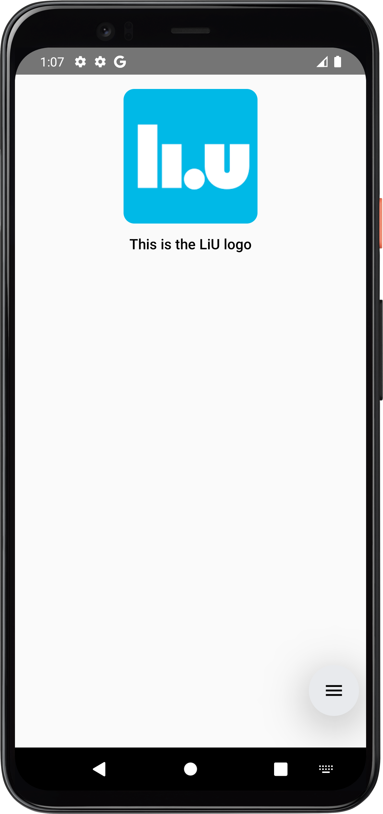
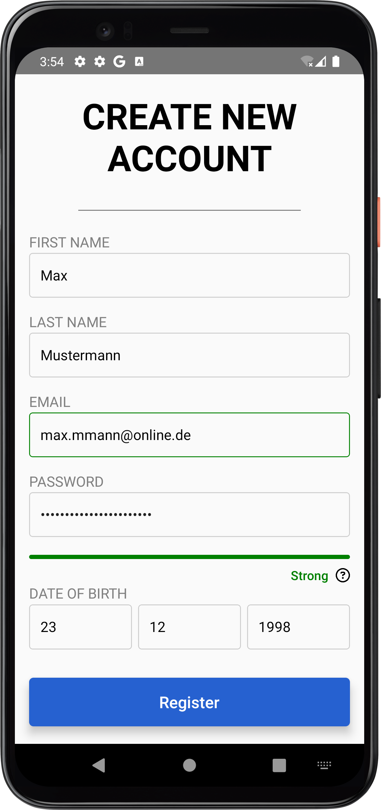

# Getting Started with React Native for Android

## Quickstart

### Prerequisites

You will need Node, the Java Development Kit and Android Studio. You can install them following [this guide](https://reactnative.dev/docs/set-up-your-environment).

#### Step 1: Create a new project

Navigate to the destination of your choice and run the following command to create a new React Native project:

```bash
npx @react-native-community/cli@latest init <<ProjectName>>
```

#### Step 2: Start Android Emulator

Open Android Studio's device manager, choose a device that you want to test your application on and start it.

#### Step 3: Start your application

From the root of your project, run the following command:

```bash
npx react-native run-android
```

If everything is set up correctly, you should see your new app running in your Android Emulator.

#### Step 4: Modifying your App

Now that you have successfully run the app, you can modify it. For this, open the project in your Code Editor (e.g. [VS Code](https://code.visualstudio.com/)).

1. Open `App.tsx` in the text editor of choice and make your. To use JavaScript instead of TypeScript, you can change the name of the file to `App.js` and remove the TypeScript-specific parts of the given code.
2. To see your changes double-tap the <kbd>R</kbd> key or save the edited file by pressing <kbd>Cmd ⌘</kbd>+<kbd>S</kbd>.

## Simple layout with components

The key concept of React Native are its components. Components are reusable UI elements that define the layout and the behavior of your application. The most basic ones are:

- `View`: a container that is useful for grouping components or for defining layouts
- `Text`: displays text
- `Image`: displays an image, needs a source

To give an example, in order to show an image with a text caption, your application needs a `View` component that contains an `Image` and a `Text` component, like this:

```jsx
import React from 'react';
import {Image, View, Text, StyleSheet} from 'react-native';

export default function App() {
  return (
    <View style={{padding: 16, alignItems: 'center'}}>
      <Image
        style={{width: 150, height: 150, borderRadius: 12}}
        source={require('./res/liu.png')}></Image>
      <Text style={styles.caption}>This is the LiU logo</Text>
    </View>
  );
}

const styles = StyleSheet.create({
  caption: {
    fontSize: 16,
    fontWeight: '600',
    marginTop: 12,
  },
});
```

We first import the components we need from React. Then we define the different components. The `Image` component needs a source, in this case it is a picture from the `res` folder in the project.
You can see that we are styling the different components by using the `style` attribute. You can either define the style properties directly in the attribute or use React Native's `StyleSheet`, which makes the code easier to read.

Our code produces the following screen:


You can also write your own components by using other components and modifying them:

```jsx
import React from 'react';
import {Text} from 'react-native';

export function Greeting({name}) {
  return <Text>Hello, {name}!</Text>;
}
```

Now you can use your new `Greeting` component like any other component: `<Greeting name={'Peter'}></Greeting>`.

If you want to use more than one component within your custom component, you need to wrap them in a `View` component.

## Basic interaction with listeners/callbacks functions

Listeners and callbacks are used to handle events, such as button taps for example.
In the following example we define an event listener `onPress` on a button, which triggers a callback function `handleTap` once the user taps the button. The callback function increases a counter every time it gets called. In order for the counter to be dynamically changeable, we need to use the `useState` hook from React. With this, we get a stateful `counter` variable and a function `setCounter` to update its value. We can display the counter in a `Text` component by accessing it with `{counter}`.

```jsx
import React, {useState} from 'react';
import {View, Button, Text} from 'react-native';

export default function App() {
  const [counter, setCounter] = useState(0);

  const handleTap = () => {
    setCounter(counter + 1);
  };

  return (
    <View style={{padding: 16, alignItems: 'center'}}>
      <Button title="Click me" onPress={handleTap} />
      <Text style={{marginTop: 8}}>
        Button has been pressed {counter} times
      </Text>
    </View>
  );
}
```

## Navigation between different screens

To navigate between different screens, React Native uses libraries like `React Navigation` and some dependencies, which can be installed by running the following commands from the root of your project.

```bash
npm install @react-navigation/native
npm install @react-navigation/native-stack
npm install react-native-reanimated react-native-gesture-handler react-native-screens react-native-safe-area-context @react-native-community/masked-view
```

Let's now define two components that we want to navigate between in a folder called `components`.
First, we have a HomeScreen in `HomeScreen.js`, which only contains a `Text` component and a button to navigate to the second screen.

```jsx
import React from 'react';
import {View, Text, Button} from 'react-native';

export function HomeScreen({navigation}) {
  return (
    <View style={{flex: 1, justifyContent: 'center', alignItems: 'center'}}>
      <Text>We are now on the HomeScreen</Text>
      <Button
        title="Go to SecondScreen"
        onPress={() => navigation.navigate('Second')}
      />
    </View>
  );
}
```

Then, we do the same for the second screen in `SecondScreen.js`. The `navigation` prop will automatically be passed to the screens if they are wrapped in a navigation stack, which will be explained later. We can use this prop to call methods like `.navigate('Second')`, which navigates to the screen where its name matches the given string, or `.goBack()`, which navigates back to the last screen.

```jsx
import React from 'react';
import {View, Text, Button} from 'react-native';

export function SecondScreen({navigation}) {
  return (
    <View style={{flex: 1, justifyContent: 'center', alignItems: 'center'}}>
      <Text>We are now on the SecondScreen</Text>
      <Button
        title="Go back to HomeScreen"
        onPress={() => navigation.goBack()}
      />
    </View>
  );
}
```

In order for the navigation to work, we need to wrap the two screens in a `NavigationContainer`, imported from _React Navigation_ and create a Stack Navigator like in the example below. We also need to define a name, which can then be used to identify the different screens like in the example above (`navigation.navigate('Second')`).

```jsx
import * as React from 'react';
import {NavigationContainer} from '@react-navigation/native';
import {createNativeStackNavigator} from '@react-navigation/native-stack';
import {HomeScreen} from './components/HomeScreen';
import {SecondScreen} from './components/SecondScreen';

const Stack = createNativeStackNavigator();

export default function App() {
  return (
    <NavigationContainer>
      <Stack.Navigator>
        <Stack.Screen name="Home" component={HomeScreen} />
        <Stack.Screen name="Second" component={SecondScreen} />
      </Stack.Navigator>
    </NavigationContainer>
  );
}
```

## Mini SDK

This mini SDK contains two components: `AccountRegistration`, which is a form to register a new account and `PasswordStrengthmeter`, which gives the user feedback about the strength of the password they are entering. You can see both of them in the picture below



### How to use the mini SDK in your own project

#### Step 1: Download MiniSDK

First, you need download the [`mini-sdk-0.0.1.tgz`](https://github.com/MadiiW/InteractionProgrammingLabs/blob/master/MiniSDK/mini-sdk-0.0.1.tgz) file from this repository.

#### Step 2: Install with npm

In your project, navigate to the root directory and run the following command:

```bash
npm install ./path/to/mini-sdk-0.0.1.tgz
```

#### Step 3: Use components

You can now use the components as you wish in your own project. Below, you will find an example on how to access the different contents of the input fields and how to handle changes on their values.

```jsx
import React, {useState} from 'react';
import {ScrollView, Text, StyleSheet} from 'react-native';
import {PasswordStrengthmeter, AccountRegistration} from 'mini-sdk';

export default function App() {
  const [firstNameValue, setFirstNameValue] = useState('');
  const [lastNameValue, setLastNameValue] = useState('');
  const [emailValue, setEmailValue] = useState('');
  const [passwordValue, setPasswordValue] = useState('');
  const [birthday, setBirthday] = useState({day: '', month: '', year: ''});

  const handlePasswordChange = password => {
    console.log('New password value:', password);
  };

  return (
    <ScrollView style={{padding: 16}}>
      <AccountRegistration
        title="Create new account"
        handleButtonTap={() => {
          console.log('First name: ' + firstNameValue);
          console.log('Last name: ' + lastNameValue);
          console.log('Email: ' + emailValue);
          console.log('Password: ' + passwordValue);
          console.log(
            'Birthday: ' +
              birthday.day +
              '.' +
              birthday.month +
              '.' +
              birthday.year,
          );
        }}
        firstNameValue={firstNameValue}
        setFirstNameValue={setFirstNameValue}
        lastNameValue={lastNameValue}
        setLastNameValue={setLastNameValue}
        emailValue={emailValue}
        setEmailValue={setEmailValue}
        passwordValue={passwordValue}
        setPasswordValue={setPasswordValue}
        birthday={birthday}
        setBirthday={setBirthday}
      />

      <PasswordStrengthmeter
        title={'Choose a strong password'}
        style={{marginVertical: 32}}
        onPasswordChange={handlePasswordChange}
      />
    </ScrollView>
  );
}
```

### Component customization

Here is a list of what you can customize in the components:

##### AccountRegistration

- `title` = "Creating new account" per default, title of the form
- `hasFirstNameField`, `hasLastNameField`, `hasBirthdayField`: all true per default, defines if the corresponding input field should be included in the form
- `submitButtonText`: "Register" per default, text on the submit button
- `submitButtonColor`: '#2560D0' per default, background color of the submit button
- `handleButtonTap`: callback function that gets called when the submit button gets tapped
- `firstNameValue`: current value of the "First Name" input field, must be provided if `hasFirstNameField` is `true`
- `setFirstNameValue`: callback function used to update the value of the "First Name" input field when the user types
- `lastNameValue`: current value of the "Last Name" input field, must be provided if `hasLastNameField` is `true`
- `setLastNameValue`: callback function used to update the value of the "Last Name" input field when the user types
- `emailValue`: current value of the "Email" input field,must be provided
- `setEmailValue`: callback function used to update the value of the "Email" input field when the user types
- `passwordValue`: current value of the "Password" input field, must be provided
- `setPasswordValue`: callback function used to update the value of the "Password" input field when the user types

- `birthday`: object containing the day, month, and year values for the "Date of Birth" input fields (e.g `{ day: '12', month: '05', year: '1990' }`), must be provided if `hasBirthdayField` is `true`
- `setBirthday`: callback function used to update the `birthday` object when the user modifies the day, month, or year inputs

##### PasswordStrengthmeter

- `title`: "Choose your password" per default, the text above the input field
- `style`: you can style the component, for example add margins or paddings
- `minPasswordLength`: 10 per default, defines when the password is "too short"
- `preferredPasswordLength`: 18 per default, defines when the length of the password is long enough to satisfy one more constraint
- `onPasswordChange`: callback function that gets called every time the text in the password input field changes
